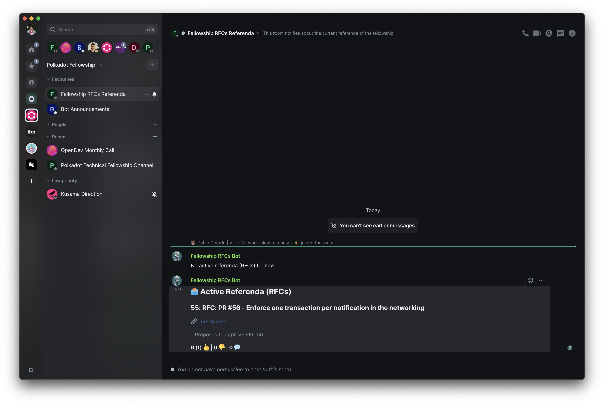

# Fellowship Referenda Bot



This bot aims to publish a digest of the active referenda in the announcements channel of Polkadot Fellowswhip (and works with similar referenda-like systems).

[Join here](https://matrix.to/#/#fellowship-rfcs:bloque.team)


## Usage

1. Setup the environment

```sh
MATRIX_HOMESERVER_URL=https://matrix.org

# to login use
MATRIX_USERNAME="the_bot_username"
MATRIX_PASSWORD="the_bot_password"
# or
MATRIX_AUTHTTOKEN="a_session_authttoken"

MATRIX_ROOMID="#roomId:matrix.org"

SUBSTRATE_ENDPOINT_URL=wss://polkadot-collectives-rpc.polkadot.io/
SUBSTRATE_REFERENDA_PALLET=referenda

SUBSQUARE_HOST=subsquare.io
SUBSQUARE_CHAIN=collectives
```

2. Run `npm start`

### Development

1. Follow the instructions stated above, then run `npm run dev`. The difference is that bot message will be outputted to console instead of sent via Matrix.
